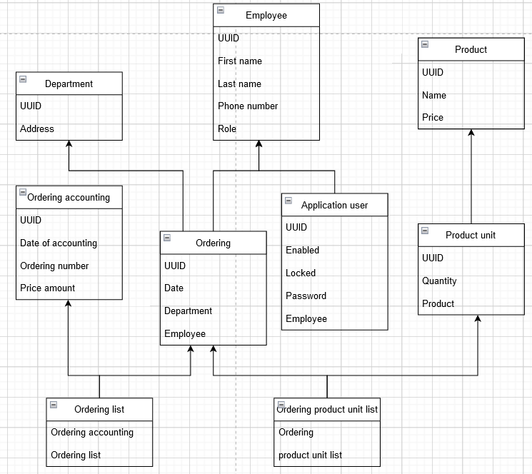

# Delmon (Delivery monitoring)
Delmon – is a full stack application, organizes the process of communication between supplier and  warehouseman of the stores chain

### Tech stack:
* Backend – Java 8, Lombok, Spring (Boot, MVC, Data, Security), PostgreSQL
* Frontend – Angular, Bootstrap

### Conceptual model of DB:

#

Frontend repository: https://github.com/DmitriyPavlichenko/DeliveryMonitoringApp
